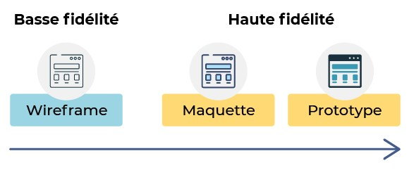
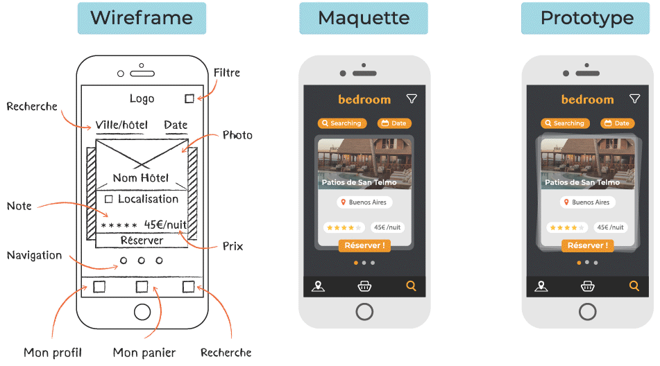
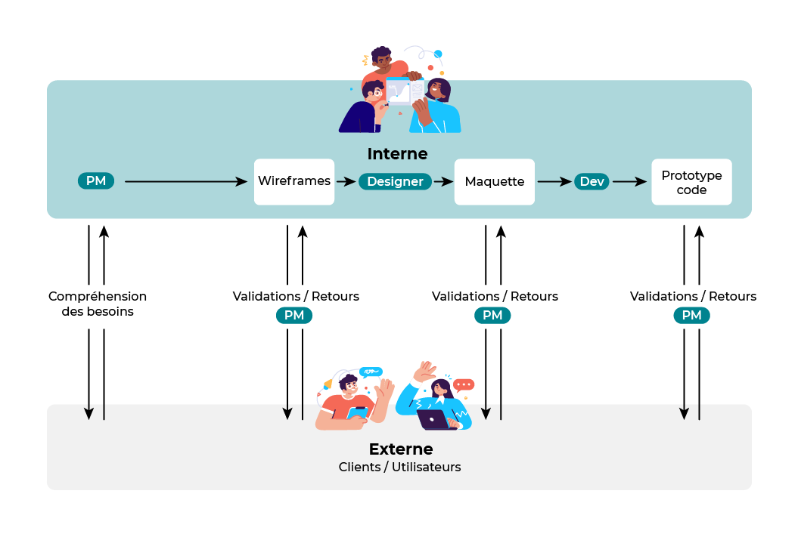
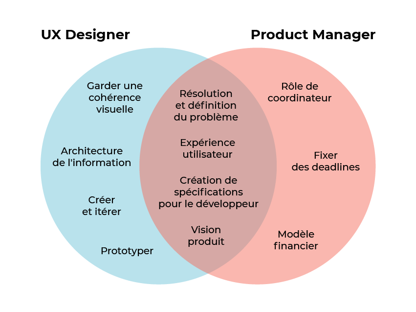

## Intro
A mockup is a **full-size model** of what you want to create, be it a website, software, mobile app, etc. A mockup can be thought of as a sort of **simulation** of what your product will look like .

Modeling includes several stages:

1. **Wireframe** (or "wireframes"). This is a **low-fidelity** representation of your project. Created manually or with software, wireframes are the skeleton of a site: what content should be displayed, a hierarchy of information, and a simple description of intended user interactions.
2. **Mockup**. This time the model corresponds to a **high fidelity** representation of the interface, hence the design. He takes the framework of wireframe, details it, and adds a visual dimension. **The model remains static**: we will have a series of screens of our full size site that we cannot interact with.
3. **Prototype**. The prototype, for its part, uses a high fidelity representation but adds a dynamic dimension to it. Indeed, it is possible to interact with the prototype and therefore simulate the user experience (UX), for example, by clicking on links leading to the desired screens, scrolling through menus, etc.

Yes, creating wireframes, mockups, and prototypes takes time, but taking that time in advance before moving on to the code will save you a lot of trouble.

Modeling has very important interests:
- The model is a pillar for cooperation. Each step (framework, model, prototype) allows everyone, regardless of their experience, to discuss needs. Exchanges can be internal, between different transactions, or with external people such as customers or future users.
- Secondly, it allows us to think about practicality and aesthetics separately, giving them equal importance.
- It's also a great way to visualize the work ahead and thus estimate the time (and therefore budget) needed to complete the project.
- And finally, and this will not disappoint you, it avoids coding elements that will not be saved, which saves time.

1. The **Product Manager** (PM) will first discuss with the **users/customers** to list the needs. This pre-research phase can also be done entirely at the same time as **UX-Designer**. They can then develop **wireframe**s based on their understanding of these needs, allowing them to test their understanding of the need with users.
2. Then comes the model stage. Rendering is visual, the designer designs the models. The model allows for a new stage of exchange with users provided by the product manager. He or she will have a more business oriented approach while the **UX-designer** will really focus on the user experience.
3. Finally, comes the **prototyp**ing stage, which is always done by the **UX-designer** in collaboration with the **product manager**. The prototype allows for a new phase of sharing and validation with **users/customers**, as well as validating the behaviors that need to be developed.

